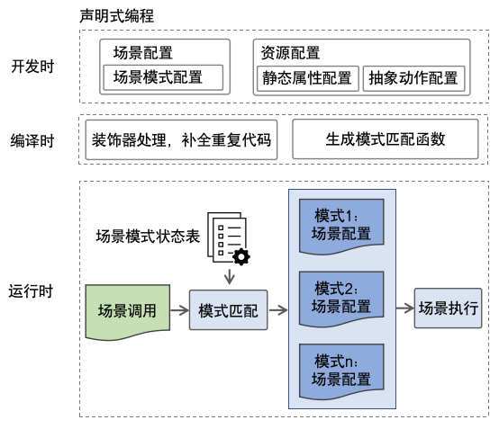

# 初识RaScript

RaScript是一种面向移动应用资源管理的DSL。RaScript基于TypeScript（简称TS）语言扩展而来，是TS的超集。

* RaScript继承了TS的所有特性。
* RaScript在TS基础上主要扩展了声明式资源管理的能力，让开发者以更简洁、更自然的方式对移动设备资源进行开发。 当前扩展的声明式资源管理包括如下特性：

基本资源描述：RaScript定义了装饰器、场景模式、自定义场景、抽象资源描述机制，再配合移动应用开发框架中的内置资源管理类、事件方法、属性方法等共同构成了资源开发的主体。&#x20;

数据处理：RaScript提供了多维度的数据处理机制，资源之间的关联数据，可通过阻塞队列实现有序异步传递，通过消息分发机制实现全局传递。开发者可以灵活的利用这些能力来实现资源间数据的联动。

动态构建场景：RaScript提供了动态构建资源使用场景的能力，不仅可自定义场景内部的抽象资源种类，还可复用抽象资源组件的静态属性。

异常处理能力：RaScript提供了自动异常捕获能力和可配置的错误处理机制。

场景自适应：用户在调用场景函数时，系统会自动匹配符合当前的场景模式的场景函数，进行执行。

内置资源组件：Mic、Sensor、Location、Storage、Camera、CPU、Memory、Display、 Speaker。

RaScript开发编译运行示意图如下：

<figure><figcaption></figcaption></figure>
