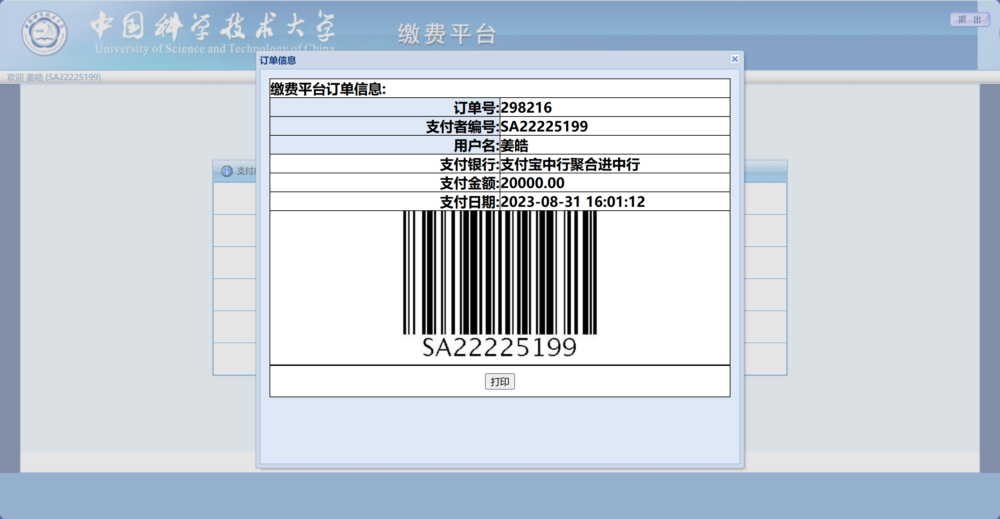

# 资源分类与访问

#### 抽象原则

原则1：抽象资源用于屏蔽异构平台，异构设备，向上层提供统⼀的设备操作接口。&#x20;

原则2：抽象动作用于方便中间件（如编译器，运行时插件等）的资源状态管理及提供自适应的解决方 案。

#### 资源描述

<table data-full-width="false"><thead><tr><th>物理资源</th><th>资源描述</th><th>抽象资源</th></tr></thead><tbody><tr><td>相机（Camera）</td><td>
种类：前置、后置、红外、外接等多种；

特点：对相机进行设置，读取相机数据流
</td><td>RCameraManager：把所有Camera统一抽象成一个 CameraManager供上层调用</td></tr><tr><td>传感器（Sensor）</td><td>
种类：动态、位置、环境等多种；

特点：对传感器进行设置，读取传感器数据流
</td><td>RSensorManager：把所有Sensor统一抽象成一个SensorManager供上层调用</td></tr><tr><td>麦克风（Mic）</td><td>
种类：主Mic、副Mic、内置、外接等；

特点：对麦克风进行设置，读取音频数据流
</td><td>RMicManager：把所有Mic统一抽象成一个MicManager供上层调用</td></tr><tr><td>扬声器（Speaker）</td><td>
种类：内置、外接等；

特点：对扬声器进行设置，获取当前播放的音频数据流
</td><td>RSpeakerManager：把所有Speaker统一抽象成一个 SpeakerManager供上层调用</td></tr><tr><td>CPU</td><td>特点：自动执行、可通过采样或追踪进行应用优化</td><td>RCPUManager：把所有CPU内部资源统一抽象成一个CPUManager供上层调用</td></tr><tr><td>内存（Memory）</td><td>特点：自动内存管理、可通过采样或追踪进行应用优化</td><td>RMemManager：把所有内存资源统一抽象成一个MemManager供上层调用</td></tr><tr><td>屏幕（Display）</td><td>
种类：单屏或多屏；

特点：多屏同显、多屏异显
</td><td>RDisplayManager：把所有Display统一抽象成一个 DisplayManager供上层调用</td></tr></tbody></table>

通用抽象动作：

设备打开 onOpen ? : (result: String) => void

设备关闭 onClose ? : (result: String) => void

可⽤资源列表 onDeviceList ? : (result: List) => void

设备原始数据流 onOriginData ? : (result : any) => void

| 物理资源        | 资源描述                               | 抽象资源                                                |
| ----------- | ---------------------------------- | --------------------------------------------------- |
| 存储（Storage） | 
种类：文件、DB等；

特点：数据流可读可写
 | RStoreManager：把所有Storage统一抽象成一个 StorageManager供上层调用 |

#### 资源抽象类图

<figure><figcaption></figcaption></figure>

